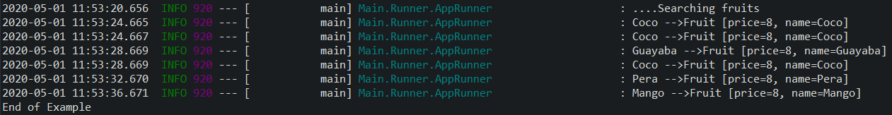

# spring-cache-example
An example of how to use Spring Cache

<h3>This example proposes the use of @Cacheable to improve the performance of the application making use of the cache provided by spring</h3>
Dependencias:
<ul>
<li>spring-boot-starter-cache</li>
</ul>

In the MirrorFruitRepository class a 4s delay is inserted in the <b>getByName (String name)</b> method to demonstrate the advantages of using the cache

In the case of the first two results, the delay is not noticeable because as the search is repeated with the same parameter, the second result is the product of the cache

<ul>
<li>Coco -->Fruit [price=8, name=Coco]</li>
<li>Coco -->Fruit [price=8, name=Coco]</li>
</ul>

The same thing happens when obtaining the third result because the fourth request returns an already chased result.

<ul>
<li>Guayaba -->Fruit [price=8, name=Guayaba]</li>
<li>Coco -->Fruit [price=8, name=Coco]</li>
</ul>

This is possible due to the use of @Cacheable in the  <b>getByName (String name)</b> method of the <b>MirrorFruitRepository</b> class and the use of <b>@EnableCaching</b> in the Main class.

